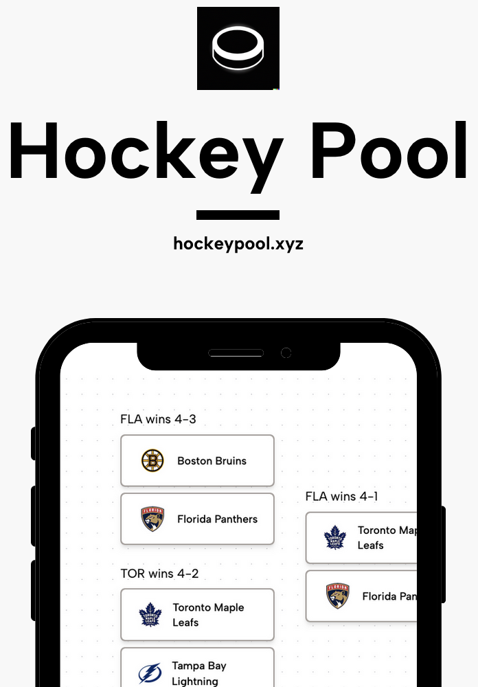

# Hockey Pool

<p align="center">
Hockey Pool is an application where you compete with fellow fans to predict the NHL tournaments outcomes and vie for ultimate glory. 🏒🥅
</p>

<p align="center">
  
</p>


## Introduction

Hockey Pool is a web application built with Next.js, Express.js, Prisma, Redis and PostgreSQL. It is a full stack application that allows users to create an account, join a pool, and make predictions on the outcomes of NHL tournaments. The application is deployed on Digital Ocean and Vercel can be found at [hockeypool.xyz](https://hockeypool.xyz).

Every night the application will fetch the latest NHL tournament games and update the database. The application will then calculate the points for each user based on their predictions and the actual outcomes of the games. The user with the most points at the end of the tournament wins the pool.

## Features

- Create an account
- Join a pool
- Make predictions on the outcomes of NHL tournaments
- View the leaderboard to see how you stack up against the competition
- View the schedule of upcoming games
- View the results of past games
- View the results of past tournaments

## Tech Stack

- [Next.js](https://nextjs.org/)
- [Express.js](https://expressjs.com/)
- [Prisma](https://www.prisma.io/)
- [Redis](https://redis.io/)
- [PostgreSQL](https://www.postgresql.org/)
- [Clerk](https://clerk.dev/)
- [Digital Ocean](https://www.digitalocean.com/)
- [Vercel](https://vercel.com/)
- [Tailwind CSS](https://tailwindcss.com/)
- [Bullmq](https://docs.bullmq.io/)


## Getting Started

### Prerequisites 

- [Node.js](https://nodejs.org/en/)
- [PostgreSQL](https://www.postgresql.org/)
- [Redis](https://redis.io/)
- [Docker](https://www.docker.com/)
- [pnpm](https://pnpm.io/)
- [npx](https://www.npmjs.com/package/npx)
- [Git](https://git-scm.com/)


### Installation

1. Clone the repo
   ```sh
   git clone https://github.com/owen-duncan-snobel/hockey-pool
    ```
2. Install dependencies (Server and Client)
   ```sh
   cd packages/server/ && pnpm install
   ```
   and 

   ```sh
   cd packages/www && pnpm install
   ```

3. Copy the .env.example file and rename it to .env and fill in the environment variables with your own values.
   ```sh
   cp .env.example .env
   ```
4. Build the docker container for the packages/server
   ```sh
   pnpm run docker:build
   ```
5. Start the docker container for the packages/server
   ```sh
   pnpm run docker:up
   ```
6. Run the migrations
   ```sh
    npx prisma migrate dev
    ```
7. Seed the database
  
8. Start the /packages/www client
   ```sh
   pnpm run dev
   ```
9. Open [http://localhost:3000](http://localhost:3000) with your browser to see the client result.

10. Optional: Start the /packages/www storybook server
   ```sh
   pnpm run storybook
   ``` 
   and open [http://localhost:6006](http://localhost:6006) with your browser to see the storybook stories.

11. Run the tests
   ```sh
   pnpm run test
   ```

More detailed instructions for the server can be viewed in the [server README](packages/server/README.md).

## Roadmap

- Onboard all manual Users
- Load users picks from Excel from previous years
- Add Chat features
- Add User Dashboard to view all past picks and results
- Email remainders 
- Stripe Integration
- 2024 Playoff Launch


## Disclaimer

This project is not affiliated with the NHL or any of its affiliates. All NHL logos and marks and NHL team logos and marks depicted herein are the property of the NHL and the respective teams and may not be reproduced without the prior written consent of NHL Enterprises, L.P. © NHL 2021. All Rights Reserved.

The NHL has not reviewed or approved this project or its contents and the NHL is not responsible for the content of this project. The API data comes from the NHL API but is not endorsed or certified by the NHL.